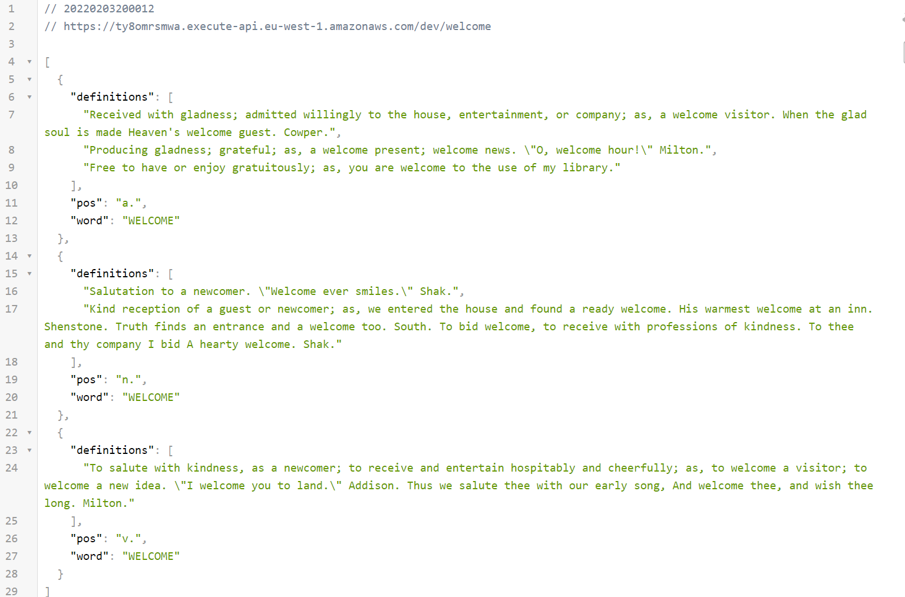
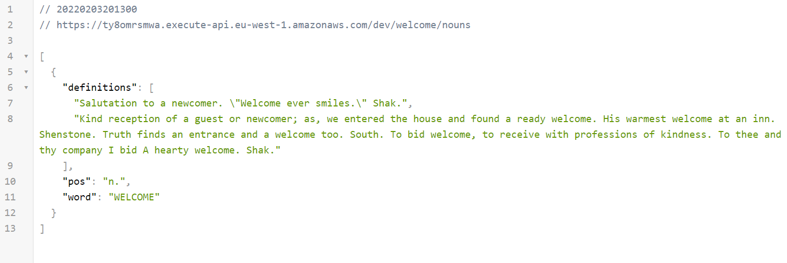
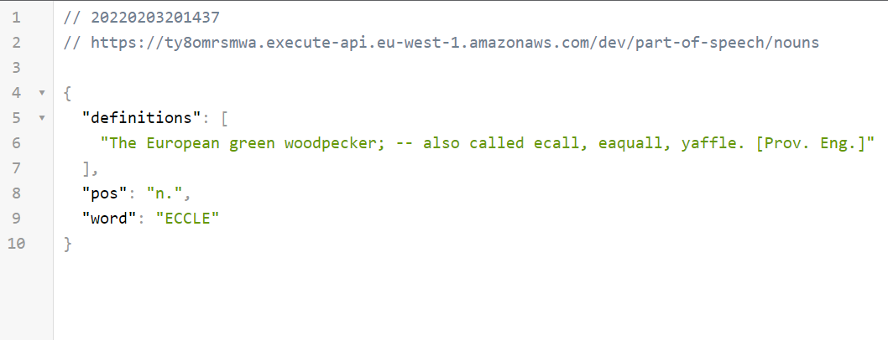
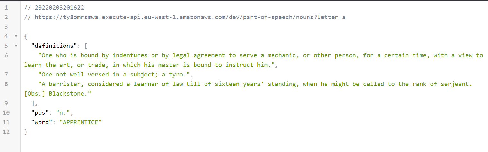

# API to My dictionary

## URL: https://ty8omrsmwa.execute-api.eu-west-1.amazonaws.com/dev/

## In this API you can get result of four situation:

## 1. GET /:word - will return all the word definition & part of speech

## 2. GET /:word/:partOfSpeech - will return a word + definition + part of speech (noun, verb, adjectives, etc...)

## 3. GET /part-of-speech/:part - will return a random word + definition + part of speech

## 4. GET /part-of-speech/:part?letter=X - will return a random word which start with the same letter + definition + part of speech

